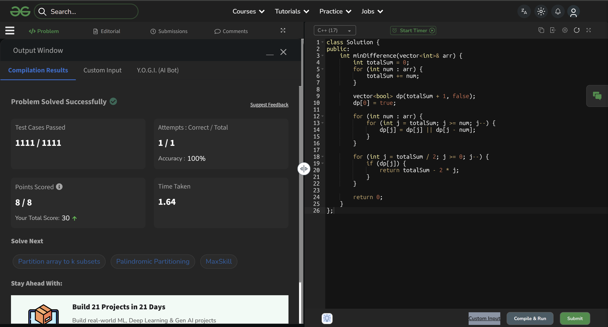

# Experiment 9 - Partition Array with Minimum Difference

## Problem Description

Given an array of `n` positive integers, divide it into two subsets such that the difference between their sums is minimized.

In other words, split the array into two subsets **S1** and **S2** such that:

`| sum(S1) - sum(S2) |` is as small as possible.

**Reference:** https://www.geeksforgeeks.org/problems/minimum-sum-partition3317/1

---

## Algorithm

```
1. Compute totalSum = sum of all elements in the array
2. Create a boolean array dp[0...totalSum]
   where dp[j] tells whether a subset with sum j is possible
3. Initialize dp[0] = true
4. For each element in the array:
       For j from totalSum down to the element value:
           dp[j] = dp[j] OR dp[j - element]
5. Traverse from totalSum/2 down to 0:
       The first j where dp[j] is true gives:
       minimum difference = totalSum - 2*j
```

---

## Code (C++)

```cpp
class Solution {
public:
    int minDifference(vector<int>& arr) {
        int totalSum = 0;
        for (int num : arr) {
            totalSum += num;
        }

        vector<bool> dp(totalSum + 1, false);
        dp[0] = true;

        for (int num : arr) {
            for (int j = totalSum; j >= num; j--) {
                dp[j] = dp[j] || dp[j - num];
            }
        }

        for (int j = totalSum / 2; j >= 0; j--) {
            if (dp[j]) {
                return totalSum - 2 * j;
            }
        }

        return 0;
    }
};
```

---

## Dry Run

**Input:** `n = 4`, `arr = [1, 6, 11, 5]`

**Step 1:**  
Total sum = 23

**Step 2:**  
Initialize dp → only `dp[0] = true`

**Step 3:**  
Update possible subset sums:

- After 1 → {0, 1}  
- After 6 → {0, 1, 6, 7}  
- After 11 → {0, 1, 6, 7, 11, 12, 17, 18}  
- After 5 → {0, 1, 5, 6, 7, 11, 12, 16, 17, 18, 22, 23}  

**Step 4:**  
Check from 11 downwards:

- dp[11] = true  
- Subset sums = 11 and 12  

Minimum difference = **1**

---

## Time and Space Complexity

| Metric           | Value       | Description                          |
|------------------|-------------|--------------------------------------|
| Time Complexity  | O(n × sum)  | DP computation over all sums         |
| Space Complexity | O(sum)      | Boolean DP array                     |

> Constraints: n ≤ 100, arr[i] ≤ 1000

---

## Example

**Input:**
```
1
4
1 6 11 5
```

**Output:**
```
1
```

**Explanation:**  
One possible partition is `{1, 5, 6}` (sum = 12) and `{11}` (sum = 11).  
The difference between sums is **1**.

---

## Code Accepted Screenshot

