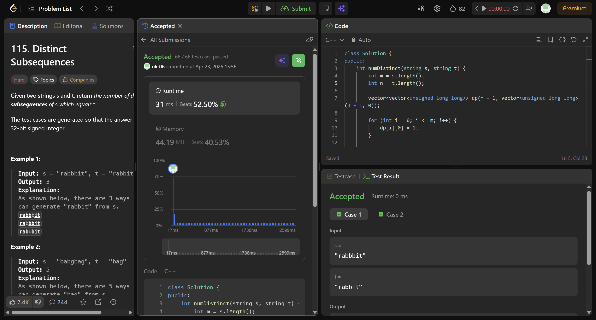

# Experiment 10 - Counting Distinct Subsequences

## Problem Description

You are given two strings `s` (source) and `t` (target). The task is to determine how many different subsequences of `s` are equal to `t`.

A subsequence is obtained by removing zero or more characters from a string while keeping the order of the remaining characters unchanged.

**Reference:** https://leetcode.com/problems/distinct-subsequences/description/

---

## Algorithm

```
1. Let m = length of string s and n = length of string t
2. Create a 2D DP array dp of size (m+1) × (n+1)
   where dp[i][j] represents the number of ways to form
   the first j characters of t using the first i characters of s

3. Base Conditions:
     dp[i][0] = 1 for all i (empty string t can always be formed)
     dp[0][j] = 0 for j > 0 (non-empty t cannot be formed from empty s)

4. Fill the DP table:
     For i from 1 to m:
       For j from 1 to n:
         If s[i-1] == t[j-1]:
             dp[i][j] = dp[i-1][j-1] + dp[i-1][j]
         Else:
             dp[i][j] = dp[i-1][j]

5. Final answer is stored in dp[m][n]
```

---

## Code (C++)

```cpp
class Solution {
public:
    int numDistinct(string s, string t) {
        int m = s.length();
        int n = t.length();

        vector<vector<unsigned long long>> dp(m + 1, vector<unsigned long long>(n + 1, 0));

        // Base case: empty target
        for (int i = 0; i <= m; i++) {
            dp[i][0] = 1;
        }

        for (int i = 1; i <= m; i++) {
            for (int j = 1; j <= n; j++) {
                if (s[i - 1] == t[j - 1]) {
                    // include or exclude current character
                    dp[i][j] = dp[i - 1][j - 1] + dp[i - 1][j];
                } else {
                    // skip current character
                    dp[i][j] = dp[i - 1][j];
                }
            }
        }

        return (int)dp[m][n];
    }
};
```

---

## Dry Run

**Input:** `s = "rabbbit"`, `t = "rabbit"`

Length:  
m = 7, n = 6

### Key Idea:
We count how many ways we can remove one extra `'b'` from `"rabbbit"` to match `"rabbit"`.

### Final DP Result:
The value at `dp[7][6]` gives the answer.

**Output:** `3`

---

### Additional Example

**Input:** `s = "babgbag"`, `t = "bag"`  
**Output:** `5`

---

## Complexity Analysis

| Aspect            | Complexity | Explanation                                  |
|------------------|-----------|----------------------------------------------|
| Time Complexity  | O(m × n)  | Each DP cell is computed once                |
| Space Complexity | O(m × n)  | 2D table used to store intermediate results  |

> Optimization: Space can be reduced to O(n) using a 1D DP array.

---

## Examples

**Example 1:**
```
Input:  s = "rabbbit", t = "rabbit"
Output: 3
```

**Example 2:**
```
Input:  s = "babgbag", t = "bag"
Output: 5
```

---

## Code Accepted Screenshot

